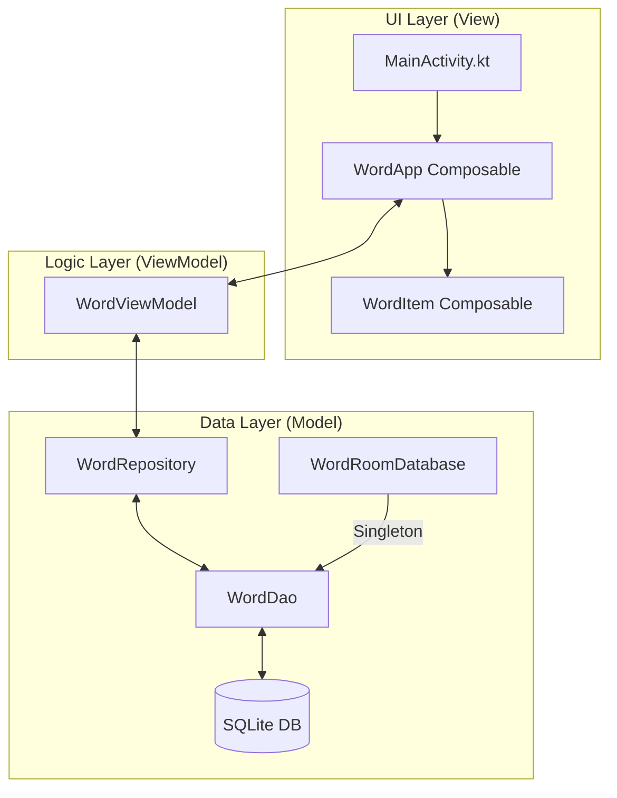
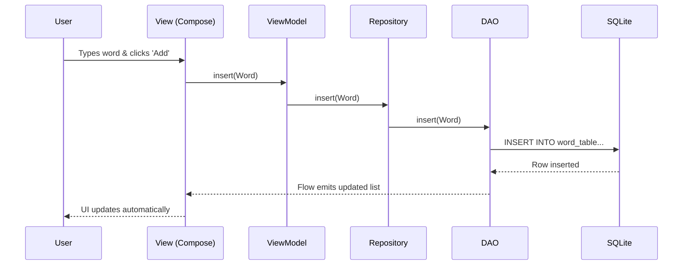

# 📘 RoomDatabaseDemo - Modern Android CRUD Showcase

<p align="center">
  
  <br>
  <b>A comprehensive educational project demonstrating Modern Android Development (MAD) practices.</b>
  <br>
  <i>Built with ❤️ using Kotlin, Jetpack Compose, and Room Database.</i>
</p>

---

## 🏆 MAD Score Card
Modern Android Development (MAD) is a set of technologies and guidance to help developers be more productive. This project hits a high score!

| Category | Technology | Status |
| :--- | :--- | :--- |
| **Language** | Kotlin 2.2.10 | ✅ Coroutines, Flow, Lazy Properties |
| **UI** | Jetpack Compose | ✅ 100% Declarative UI, Material 3 |
| **Database** | Room 2.8.4 | ✅ SQLite abstraction, Flow-based updates |
| **Architecture** | MVVM | ✅ Repository Pattern, ViewModel, StateFlow |
| **Processing** | KSP | ✅ Kotlin Symbol Processing (Faster than Kapt) |

---

## 🚀 Project Overview
**RoomDatabaseDemo** is a full-featured CRUD (Create, Read, Update, Delete) application designed as a learning resource. It showcases how to build a robust, persistent data layer in Android while maintaining a clean, reactive UI.

### 🎯 Learning Objectives
- Master **Room Persistence Library** for SQLite management.
- Implement **MVVM (Model-View-ViewModel)** architecture for separation of concerns.
- Utilize **Jetpack Compose** for a responsive and modern user interface.
- Understand **Asynchronous Programming** using Kotlin Coroutines and Flow.
- Apply **Dependency Injection** principles (Manual DI with Lazy Initialization).

---

## ✨ Key Features

### 📝 Create
- Add new items to the database via a sleek `OutlinedTextField`.
- Real-time validation to ensure no empty entries.

### 📖 Read
- Reactive list updates: The UI automatically refreshes whenever the database changes.
- Alphabetized sorting: Data is presented in a clean, sorted manner.

### 🔄 Update
- In-place editing: Tap the edit icon to pull data back into the input field.
- Seamless synchronization: Updates are reflected immediately across the app.

### 🗑️ Delete
- Single item removal: Swipe or tap to delete specific entries.
- Global clear: "Delete All" functionality for database management.

---

## 🏗️ Architecture: MVVM Pattern

This project strictly follows the **Model-View-ViewModel** architecture to ensure scalability and testability.



### Component Breakdown:
1.  **View (Compose)**: Observes `StateFlow` from the ViewModel and renders the UI.
2.  **ViewModel**: Manages UI state and handles events. It survives configuration changes.
3.  **Repository**: The "Single Source of Truth." It mediates between the DAO and the ViewModel.
4.  **DAO (Data Access Object)**: Defines the SQL queries and maps them to Kotlin functions.
5.  **Database**: The Room database holder and main access point for the underlying SQLite connection.

---

## 📊 Database Schema & Data Flow

### Entity: `word_table`
| Column | Type | Constraints |
| :--- | :--- | :--- |
| `id` | Integer | Primary Key, Auto-Generate |
| `word` | String | Not Null |

### 🔄 Data Flow Chart


---

## 🛠️ Tech Stack & Tools

- **Kotlin**: The primary language, leveraging advanced features like Coroutines and Flow.
- **Jetpack Compose**: Android's modern toolkit for building native UI.
- **Room**: Provides an abstraction layer over SQLite to allow fluent database access.
- **KSP (Kotlin Symbol Processing)**: Used for generating Room code at compile-time (2x faster than Kapt).
- **Coroutines**: For managing background tasks without blocking the main thread.
- **Flow/StateFlow**: For reactive stream processing and UI state management.
- **Material 3**: The latest evolution of Material Design for Android.

---

## 📸 Screenshots

| Empty State | Adding Data | CRUD Actions |
| :---: | :---: | :---: |
|  |  |  |

---

## ⚙️ Installation & Setup

1.  **Clone the Repository**:
    ```bash
    git clone https://github.com/yourusername/RoomDatabaseDemo.git
    ```
2.  **Open in Android Studio**:
    - Use Android Studio Ladybug (2024.2.1) or newer.
3.  **Sync Gradle**:
    - Let the IDE download dependencies (Room, Compose, KSP).
4.  **Run**:
    - Select your device/emulator and click the 'Run' button.

---

## 🛣️ Roadmap & Future Enhancements

- [ ] **Search Functionality**: Filter words in real-time.
- [ ] **Category Tags**: Group words by type or context.
- [ ] **Hilt Integration**: Move from manual DI to Dagger Hilt.
- [ ] **Unit Testing**: Add comprehensive tests for the DAO and ViewModel.
- [ ] **Dark Mode Support**: Enhance the UI for all system themes.

---

## 👨‍💻 Author
**Baris Karapinar**
- * Android Developer & Tech Enthusiast 

---
<p align="center">
  <b>Thanks for checking out this project! Happy Coding! 🚀</b>
</p>
